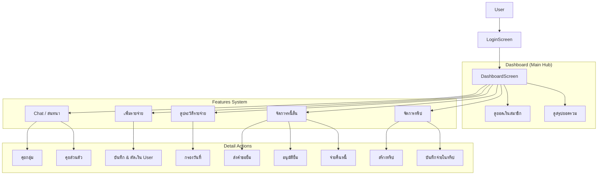

# Family Payment Mobile App System Flow

เอกสารนี้อธิบาย Use Case และ Flow การทำงานของระบบโมบายล์แอปพลิเคชันอย่างละเอียด สำหรับสมาชิกในครอบครัวและผู้ดูแลระบบ

## 1. Actor (ผู้ใช้งานระบบ)
*   **สมาชิก (Member):** ผู้ใช้งานทั่วไป สามารถบันทึกค่าใช้จ่าย ดูยอดเงิน แชท และจัดการรายการส่วนตัว
*   **ผู้ดูแลระบบ (Admin/Moderator):** (ในเวอร์ชันปัจจุบันสิทธิ์ยังเท่ากันทุก User)

---

## 2. โครงสร้าง Use Case ทั่วไป (Overview)
ระบบประกอบด้วย 5 แถบเมนูหลัก (Bottom Navigation) และเมนูย่อยในหน้า Dashboard:
1.  **Dashboard (หน้าแรก)**: ดูภาพรวมและเข้าถึงเมนูป่อย
2.  **Members (สมาชิก)**: ดูยอดเงินของสมาชิกแต่ละคน
3.  **Add Expense (บันทึกจ่าย)**: หน้าสำหรับเพิ่มรายการค่าใช้จ่ายใหม่
4.  **Chat (สนทนา)**: ระบบแชทกลุ่มและส่วนตัว
5.  **Bills (บิล)**: (กำลังพัฒนา)

---

## 3. รายละเอียด Flow การทำงานแยกตามหน้าจอ

### 3.1 Login & Register (การเข้าสู่ระบบ)
*   **Login:**
    *   เข้าใช้งานด้วย `Email` และ `Password`
    *   หากไม่มีบัญชี -> กดไปหน้า Register
*   **Register:**
    *   กรอกข้อมูล: ชื่อ (Display Name), Email, Password, Family ID (รหัสครอบครัว)
    *   เมื่อสมัครเสร็จระบบจะล็อกอินให้อัตโนมัติ

---

### 3.2 Dashboard Screen (หน้าหลัก)
เป็นศูนย์กลางการทำงานของแอป แสดงข้อมูลภาพรวมและทางลัด

*   **View Summary Function:**
    *   **Total Expenses:** ดูยอดรวมรายจ่ายในรอบปัจจุบัน
    *   **Remaining Balance:** ดูเงินกองกลางคงเหลือ (คำนวณจากยอดเติม - ยอดจ่าย)
    *   **Total Savings:** ดูเงินออมและเป้าหมายการออมของครอบครัว
*   **Member Wallets Function:**
    *   เลื่อนดูยอดเงินคงเหลือของสมาชิกแต่ละคน (Horizontal Scroll)
    *   **Edit Balance (เฉพาะตนเอง):** คลิกไอคอนดินสอ เพื่อแก้ไขยอดเงินตั้งต้นของตัวเองในกระเป๋าได้
*   **Quick Actions (เมนูลัด):**
    *   **Debts:** ไปยังหน้าจัดการหนี้สิน
    *   **Dreams:** ไปยังหน้าเป้าหมายการออม
    *   **Trips:** ไปยังหน้าจัดการทริปท่องเที่ยว (Events)
    *   **All Expenses:** ไปยังหน้าดูประวัติการจ่ายทั้งหมด
*   **Notification Badge:** แสดงจำนวนข้อความที่ยังไม่อ่านบนไอคอน Chat ที่แถบเมนูด้านล่าง

### 3.3 Add Expense Screen (บันทึกรายจ่าย)
*   **Add Transaction Function:**
    *   กรอกยอดเงิน (`Amount`)
    *   ระบุรายละเอียด (`Description`)
    *   เลือกหมวดหมู่ (`Category`) เช่น อาหาร, เดินทาง (มีไอคอนประกอบ)
    *   เลือก **"ผู้จ่าย" (Payer):** ระบุว่าใครเป็นคนออกเงิน (ค่าเริ่มต้นเป็น User ปัจจุบัน)
    *   กด "Save" เพื่อบันทึก -> ระบบจะตัดเงินจาก Balance ของผู้จ่ายทันที
    *   กด "Cancel" เพื่อยกเลิก

### 3.4 Chat Screen (ห้องสนทนา)
ระบบสื่อสาร Real-time ภายในครอบครัว เชื่อมต่อด้วย Socket.IO

*   **Group Chat Function (ค่าเริ่มต้น):**
    *   ส่งข้อความหาทุกคนในครอบครัว
    *   ข้อความแสดงผลทันทีโดยไม่ต้องรีเฟรช
*   **Direct Message (DM) Function:**
    *   กดปุ่มเมนู (Hamburger Icon) เพื่อเปิด Sidebar รายชื่อสมาชิก
    *   เลือกสมาชิกที่ต้องการคุยด้วย -> เปลี่ยนโหมดเป็น Private Chat
    *   ส่งข้อความส่วนตัวหากันได้
*   **Unread Badges:**
    *   ระบบนับจำนวนข้อความที่ยังไม่ได้อ่านแยกตามรายชื่อคนคุย
    *   Auto-mark as read เมื่อเปิดเข้าไปอ่านห้องนั้น

### 3.5 All Expenses Screen (ประวัติการจ่าย)
*   **View Transaction History:**
    *   แสดงรายการค่าใช้จ่ายทั้งหมดในระบบ เรียงจากใหม่ไปเก่า
    *   แสดงรายละเอียด: ใครจ่าย, จ่ายอะไร, เท่าไหร่, วันที่
*   **Filter by Date Function (ใหม่!):**
    *   กดไอคอนปฏิทินมุมขวาบน
    *   เลือกวันที่ต้องการ
    *   แสดงเฉพาะรายการที่เกิดขึ้นในวันที่เลือก
    *   กดปุ่มวันที่ (ที่มีกากบาท) เพื่อล้างการกรอง (Show All)

### 3.6 Debts Screen (ระบบยืมเงิน/หนี้สิน)
จัดการการยืมเงินระหว่างสมาชิกในครอบครัว

*   **Borrow Request Function (ขอยืมเงิน):**
    *   กดปุ่ม "Borrow Money"
    *   กรอกจำนวนเงิน (`Amount`) และเหตุผล (`Reason`)
    *   เลือก **"ผู้ให้ยืม" (Lender):** เลือกสมาชิกที่มีเงินให้ยืม
    *   ระบบตรวจสอบวงเงินของผู้ให้ยืมก่อนอนุญาตให้ส่งคำขอ
    *   สถานะเริ่มต้น: `Pending`
*   **Approve/Reject Request Function (อนุมัติ/ปฏิเสธ):**
    *   ผู้ถูกขอยืม จะเห็นรายการในแท็บ "Received Requests"
    *   กด **Approve:** เพื่อโอนเงิน (สร้างรายการหนี้, ตัดเงินผู้ให้ยืม, เพิ่มเงินผู้ยืม)
    *   กด **Reject:** เพื่อยกเลิกคำขอ
*   **My Debts List (รายการหนี้สิน):**
    *   แสดงรายการที่ตนเองค้างชำระ
    *   แสดงจำนวนที่จ่ายแล้ว (`Paid`) และที่เหลือ (`Remaining`)
    *   กด **"Pay Debt"** เพื่อบันทึกการคืนเงิน (ระบบคำนวณยอดคงเหลือให้อัตโนมัติ)

### 3.7 Events/Trips Screen (กระเป๋าตังค์ทริป)
ระบบแยกกระเป๋าเงินสำหรับกิจกรรมพิเศษ เช่น ไปเที่ยวต่างจังหวัด

*   **Create Trip Function:**
    *   สร้าง Events ใหม่ (ระบุชื่อทริป, งบประมาณกองกลาง)
*   **Manage Trip Expenses:**
    *   คลิกเข้าทริป -> ดู Dashboard ของทริป (งบตั้งต้น, ใช้ไปเท่าไหร่, เหลือเท่าไหร่)
    *   **Add Expense in Trip:** เพิ่มรายจ่ายเฉพาะของทริปนี้ (ไม่ปนกับกระเป๋าหลัก)
    *   **History:** ดูรายการใช้จ่ายภายในทริป

---

## 4. แผนภาพ Flow การทำงาน (Diagram)

